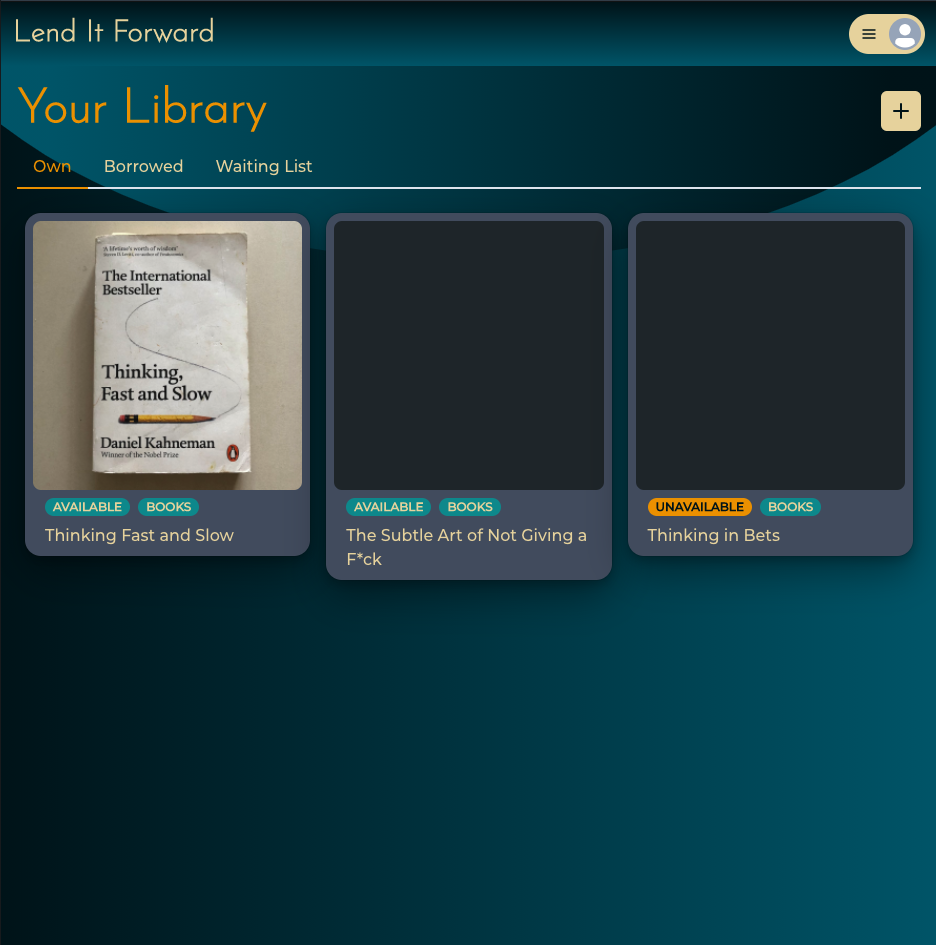

# lend-it-forward
Give your stuff a second life

Code repository: [GitHub](https://github.com/Supasiti/lend-it-forward)

Deployed application: [Heroku](https://lend-it-forward.herokuapp.com)

## <h2 id="description"> Description </h2>

A web application that allows lenders to curate their own personal libraries of items that others can borrow. 

The lenders can upload items that they want to lend out, manage their items. The borrowers can borrow any available items subjected to an approval from the lenders.

The final application is deployed on [Heroku](https://lend-it-forward.herokuapp.com). It should resemble the mock-up provided below:

## <h2 id="table-of-contents"> Table of Contents </h2>

- [Description](#description)
- [Instruction for Use](#instruction-for-use)
- [Installation](#installation)
- [Usage](#usage)
- [Technologies Used](#technologies)
- [Future Directions](#future)
- [License](#license)

## <h2 id="instruction-for-use"> Instruction for use </h2>
[(Back to top)](#table-of-content)

If you want to borrow an item:
- click `search` on the homepage and browse for the items
- select the item, and add your contact detail before submitting the request to `join the waiting list`
- if you are not already logged in, it will ask you to do so
- you can leave the waiting list anytime
- once the owner approves you as a borrower, they will contact you to organise the pick-up

If you want to lend your items:
- create an account
- if successful, this will take you to your library
- click `+` on your library, and fill out any detail about your item.
- click `save` and add more information if you want
- when ready, change the status from `unavailable` to `available`
- this will allow other people to see your item 
- once a borrower joing a waiting list, select one them to `reserve` the item for them
- this is where you will need to contact them to organise any pick up
- once the item is picked up, click `Item is collected`
- their contact information will be on displayed for the duration of borrow

## <h2 id="installation"> Installation </h2>
[(Back to top)](#table-of-content)

If you would like to work on a copy of this web application, you can follow these steps to set it up.

### Step 1: Load and install all dependencies

To use this project, first clone the repo on your device using the commands below:

    git clone https://github.com/Supasiti/lend-it-forward.git

Then install all the required libraries by running the follow command

    npm run install 

### Step 2: Setting up MongoDB on Mongo Atlas and Cloudinary

After installing all the dependencies, you would need to set up Mongo database. An instruction on how to set it up on Mongo Atlas can be found [here](https://www.mongodb.com). In addition, you will need to set up an account with Cloudinary [here](https://cloudinary.com) and obtain your credential [here](https://cloudinary.com/documentation/how_to_integrate_cloudinary#3_add_upload_capabilities).

After setting up Mongo Atlas and Cloudinary, you would need to set up your local environment variables. On the root folder, create and open `.env` file:

    lend-it-forward> cd server
    server> touch .env
    server> open .env

In the `.env` file, enter all the following details:

    MONGODB_URI=mongodb+srv....
    JWT_SECRET=<your-secret>

    CLOUDINARY_CLOUD_NAME=<YOUR CLOUD NAME>
    CLOUDINARY_API_KEY=<YOUR API KEY>
    CLOUDINARY_API_SECRET=<YOUR API SECRET>

### Step 3: Optional set up

To install any develop dependencies, you will need to go run `npm i --save-dev` in the `root`, `server` and  `client` folders.

    lend-it-forward> npm i --save-dev
    server> npm i --save-dev
    client> npm i --save-dev

## <h2 id="usage"> Usage </h2>
[(Back to top)](#table-of-content)

The access point for the appliction is in the main folder. The application can be run locally by the following commands:

    cd ~/pathTo/lend-it-forward
    npm start

The main application is deployed in Heroku, [here](https://lend-it-forward.herokuapp.com) 

## <h2 id="technologies"> Technologies Used</h2>
[(Back to top)](#table-of-content)

Frontend
- ReactJS
- Chakra UI
- Apollo Client (GraphQL)
- JWT

Backend
- NodeJS
- ExpressJS
- Apollo Server (GraphQL)
- graphql-upload
- Cloudinary
- Bcrypt
- JWT
- Mongoose + MongoDb

## <h2 id="future"> Future Directions </h2>
[(Back to top)](#table-of-content)

We would like to implement the following features:
- `lend it forward` option for owner so that items don't need to come back to the owner
- profile page
- chat functionality
- more responsive data (subscription base)
- better notification pattern when a borrower joins a waiting list
- location tracking for each item with map
- option for deposit
- condition check 
- user verification
- two factor authentication

## <h2 id="license"> License </h2>
[(Back to top)](#table-of-content)

Licensed under the [MIT](https://opensource.org/licenses/MIT) license.